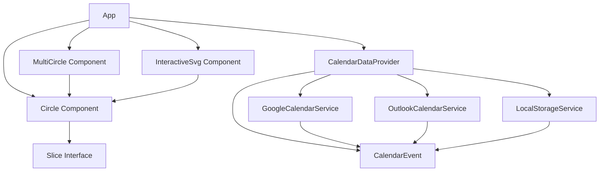

### Explanation of the New Components:

- **CalendarDataProvider**: A component responsible for fetching, processing, and providing calendar data to the views.
- **GoogleCalendarService**: A service for fetching calendar events from Google Calendar.
- **OutlookCalendarService**: A service for fetching calendar events from Outlook Calendar.
- **LocalStorageService**: A service for storing and retrieving calendar data from local storage.
- **CalendarEvent**: A typed data structure representing a calendar event.

### Integration with Existing Components:

- The `App` component interacts with the `CalendarDataProvider` to fetch and provide calendar data to the views.
- The `CalendarDataProvider` uses `GoogleCalendarService`, `OutlookCalendarService`, and `LocalStorageService` to fetch and store calendar events.
- The `Circle Component` and `MultiCircle Component` use the `CalendarEvent` data provided by the `CalendarDataProvider` to render the time line views.

This expanded diagram provides a more comprehensive view of the application's architecture, including the components responsible for handling calendar data. If you have any specific details or additional components to include, please let me know!

### Explanation of the New Components:

- **CalendarDataProvider**: A component responsible for fetching, processing, and providing calendar data to the views.
- **GoogleCalendarService**: A service for fetching calendar events from Google Calendar.
- **OutlookCalendarService**: A service for fetching calendar events from Outlook Calendar.
- **LocalStorageService**: A service for storing and retrieving calendar data from local storage.
- **CalendarEvent**: A typed data structure representing a calendar event.

### Integration with Existing Components:

- The `App` component interacts with the `CalendarDataProvider` to fetch and provide calendar data to the views.
- The `CalendarDataProvider` uses `GoogleCalendarService`, `OutlookCalendarService`, and `LocalStorageService` to fetch and store calendar events.
- The `Circle Component` and `MultiCircle Component` use the `CalendarEvent` data provided by the `CalendarDataProvider` to render the time line views.

This expanded diagram provides a more comprehensive view of the application's architecture, including the components responsible for handling calendar data. If you have any specific details or additional components to include, please let me know!
