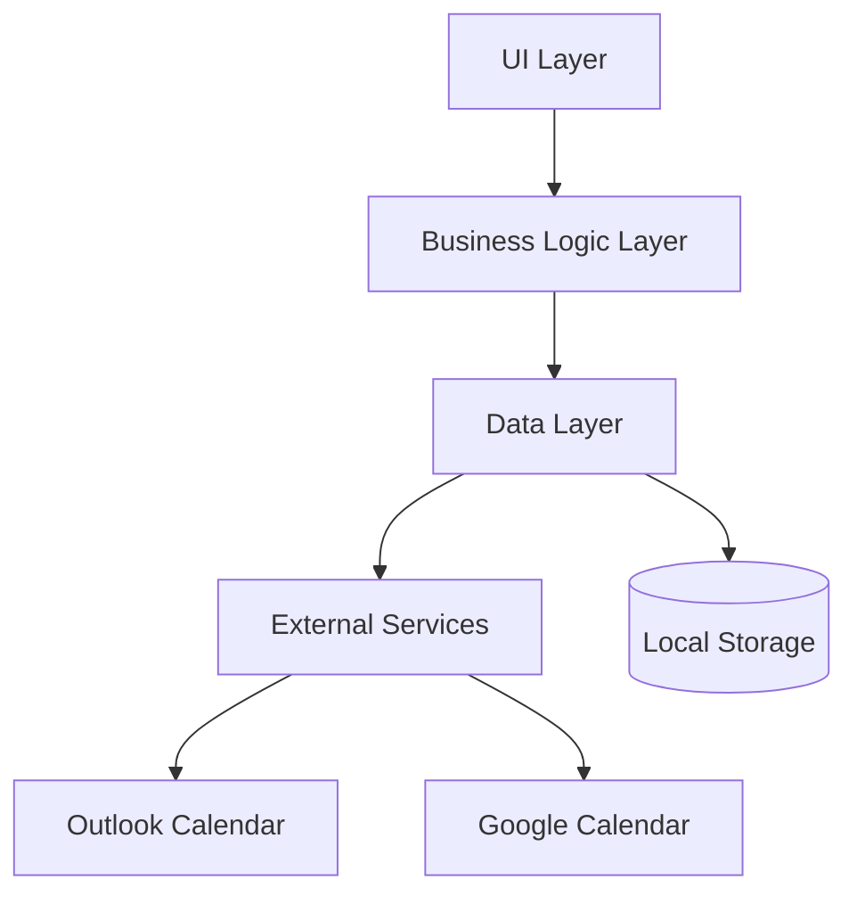

# Circular Time App Architecture

## Overview

The Circular Time App is a React Native application built with Expo that visualizes calendar events in a circular timeline. The application follows a modular architecture with clear separation of concerns.

## Core Architecture Principles

- Clean Architecture patterns
- Modular design
- Offline-first approach
- Secure authentication handling

## Main Components

1. **UI Layer**

   - Timeline Views (Day/Week/Month/Year)
   - Settings View
   - Authentication Screens

2. **Business Logic Layer**

   - Calendar Data Management
   - Authentication Services
   - Timeline Calculations

3. **Data Layer**
   - Calendar API Integration
   - Local Storage
   - State Management

