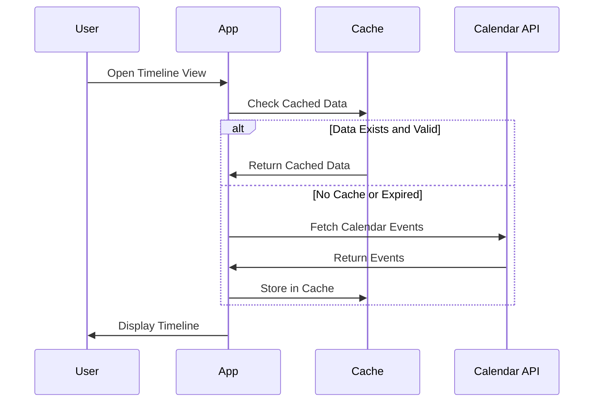
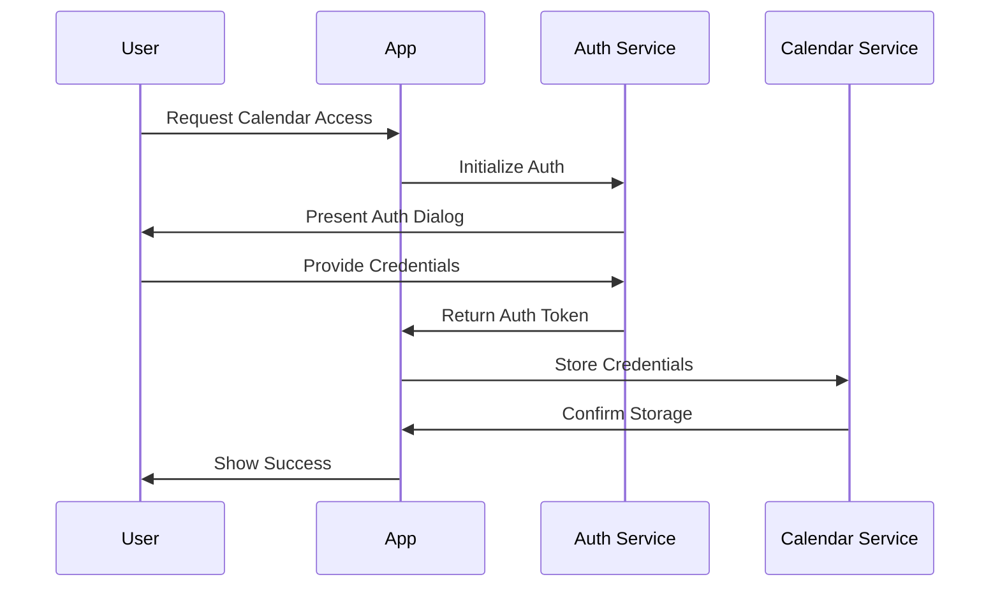

# Sequence Diagrams

## Calendar Data Fetch Sequence

```mermaid
sequenceDiagram
    participant U as User
    participant A as App
    participant C as Cache
    participant API as Calendar API

    U->>A: Open Timeline View
    A->>C: Check Cached Data
    alt Data Exists and Valid
        C->>A: Return Cached Data
    else No Cache or Expired
        A->>API: Fetch Calendar Events
        API->>A: Return Events
        A->>C: Store in Cache
    end
    A->>U: Display Timeline
```

## Authentication Flow

```mermaid
sequenceDiagram
    participant U as User
    participant A as App
    participant AS as Auth Service
    participant CS as Calendar Service

    U->>A: Request Calendar Access
    A->>AS: Initialize Auth
    AS->>U: Present Auth Dialog
    U->>AS: Provide Credentials
    AS->>A: Return Auth Token
    A->>CS: Store Credentials
    CS->>A: Confirm Storage
    A->>U: Show Success
```
