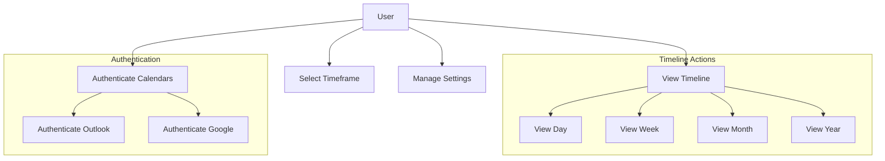

# Use Cases

## Calendar Visualization Use Cases

```mermaid
graph TB
    User --> ViewTimeline[View Timeline]
    User --> SelectTimeframe[Select Timeframe]
    User --> AuthCalendars[Authenticate Calendars]
    User --> ManageSettings[Manage Settings]

    subgraph Timeline Actions
    ViewTimeline --> ViewDay[View Day]
    ViewTimeline --> ViewWeek[View Week]
    ViewTimeline --> ViewMonth[View Month]
    ViewTimeline --> ViewYear[View Year]
    end

    subgraph Authentication
    AuthCalendars --> AuthOutlook[Authenticate Outlook]
    AuthCalendars --> AuthGoogle[Authenticate Google]
    end
```
